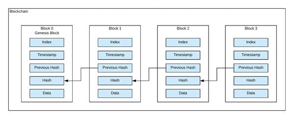

- [Basic BlockChain Terminal Application](#basic-blockchain-terminal-application)
      - [Project made by 2 contributors: ivshil  \& pmilenov-bg in pair programming](#project-made-by-2-contributors-ivshil---pmilenov-bg-in-pair-programming)
      - [This project was made for training purposes](#this-project-was-made-for-training-purposes)
# Basic BlockChain Terminal Application

#### Project made by 2 contributors: ivshil  & pmilenov-bg in pair programming
#### This project was made for training purposes

- Sample Input & Output:

        ❯ go run main.go 
        BlockChain Generated
        data:
        Sasho
        data:
        Gosho
        data:
        Pesho
        data:
        exit
        
        BlockChain blocks: 4
        
        Block Data: Pesho
        Block Index 4
        PreviousBlock Hash: 18dcd1d163e381a77e9d7f82b4e85223df3c19f8029a23b0c7db142726555327
        Block Hash: d50ebb3c29d800fce66659e386ed0d628340c9a13a031e1cb66de3a2897dc23f
        
        
        Block Data: Gosho
        Block Index 3
        PreviousBlock Hash: c42d21517290b18980ab17d362d64f5dac864e8f3e89cc82b0898ec42bde2daf
        Block Hash: 18dcd1d163e381a77e9d7f82b4e85223df3c19f8029a23b0c7db142726555327
        
        
        Block Data: Sasho
        Block Index 2
        PreviousBlock Hash: 81ddc8d248b2dccdd3fdd5e84f0cad62b08f2d10b57f9a831c13451e5c5c80a5
        Block Hash: c42d21517290b18980ab17d362d64f5dac864e8f3e89cc82b0898ec42bde2daf
        
        
        Block Data: Genesis
        Block Index 1
        PreviousBlock Hash: GenesisBlock
        Block Hash: 81ddc8d248b2dccdd3fdd5e84f0cad62b08f2d10b57f9a831c13451e5c5c80a5
        
        
        End!

- Some reference used:   https://jeiwan.net/posts/building-blockchain-in-go-part-1/
